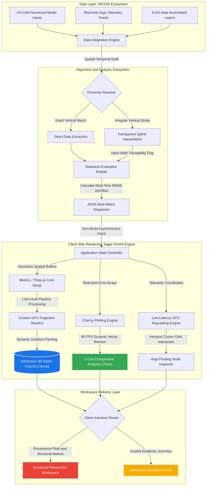

# Team-MANTHAN
# 🌊 Sagar-Drishti (सागर-दृष्टि)
> **A Zero-Installation Browser-Native 3D Ocean Intelligence & Traceable Analytics Platform**  
> *Developed for MoES - INCOIS Problem Statement (SIH26067)*

---

## 🎯 The Core Problem & Our Deep Research
Oceanographic data collected by INCOIS—encompassing key variables like Temperature, Salinity, Currents, and Chlorophyll—originates from diverse forecasting models (HYCOM) and real-time in-situ observations (Argo Floats, Gliders). Present computational workflows face key operational bottlenecks:

* **Siloed Formats:** Data is heavily fragmented across complex multi-dimensional desktop formats (NetCDF, GRIB) requiring specialized heavy software.
* **The Vertical Alignment Gap:** Standard platforms overlay data points by proximity, completely masking the mathematical vertical layer mismatches between predictive models and irregular physical buoy depths.
* **High Barrier to Entry:** Disaster response cells, maritime teams, and educational institutions lack an agile, instant-loading visual space to inspect the water column at 3D depth levels without local installation packages.

### 🔍 Our Core Innovation Framework:
1. **Traceable Spline Interpolation:** Sagar-Drishti introduces a transparent vertical depth-matching algorithm, flagging exactly when data is mathematically interpolated to align model tiers with physical observations.
2. **Dual-Stream Data Assimilation UI:** Interactive visual toggle arrays separating Raw Forecasting outputs from Ensemble Optimal Interpolation (EnOI) model fields to map localized error reductions.
3. **Dual Operational Modes:** Features an advanced **Researcher Console** for data provenance and high-density metric calculations, alongside an **Education Portal** for narrative-driven oceanic curriculum delivery.

---

## 📂 Repository Architecture & Directory Layout

To ensure seamless execution, modular scaling, and instant deployment, this repository is organized into distinct functional blocks:

```text
Sagar-Drishti/
├── backend/          # Analytical micro-services, proximity checks, and metadata endpoints
├── frontend/         # Browser-native graphics engine workspace, custom shaders, and UI layouts
├── data/             # Lightweight optimized spatial sample matrices and coordinate datasets
├── docs/             # Technical blueprints, research whitepapers, and system architecture flows
├── scripts/          # Live data ingestion scripts and automation routines for Argo telemetry
└── tasks/            # Verification pipelines executing localized RMSE and Bias evaluations
```

---

## ⚙️ System Technical Workflow

Niche hamare platform ka end-to-end data processing aur frontend rendering workflow diagram bataya gaya hai:



### ⚡ Core Frontend Engineering Choices:
* **The Zero-Build Edge:** Developed completely on raw browser-native layers (Naked WebGL via Three.js). Operates instantly out-of-the-box with no heavy compilation dependencies, ensuring ultra-fast load times.
* **GPU-Accelerated Gradients:** Volumetric data grids are processed through custom GLSL shaders executing directly on the hardware graphics pipeline, rendering smooth parameter gradients at a continuous **60 FPS**.
* **Spatial Intersection (Raycasting):** Interactive node evaluation maps screen-space clicks to 3D object arrays dynamically, bypassing heavy lookup matrices.

---

## 🗺️ Project Implementation Milestones & Timeline

### 📍 Phase 1: Spatial Ingestion & Schema Specification (Completed ✅)
* Audited multidimensional spatial vectors across target Indian Ocean parameters.
* Transformed complex NetCDF variable layouts into high-performance structural JSON arrays.
* Mapped user journeys for both data-dense analytics viewports and student-centric visuals.

### 📍 Phase 2: WebGL Engine Instantiation & Interaction Loops (Completed ✅)
* Created the core 3D projection viewport grids and depth-slice environment boxes.
* Deployed custom vertex/fragment shader programs for real-time continuous parameter mapping.
* Wired up GPU raycasting capabilities for low-latency interactive asset selection.

### 📍 Phase 3: Analytical Calibration & Dynamic Metrics (In Progress ⚙️)
* Actively integrating mathematical modules for live computation of **RMSE** and **Bias** deltas directly in the browser layer.
* Structuring the visual interpolation indicator layer to deliver perfect mathematical traceability.
* Refining the transition framework between raw forecasting fields and EnOI data-assimilated layers.

### 📍 Phase 4: Production Scale Optimization & Vernacular Deployment (Upcoming 🚀)
* Stress-testing heavy vertex arrays to guarantee high performance on mobile and lower-end hardware configurations.
* Building localized regional-language guided paths for academic distribution across institutional networks.
