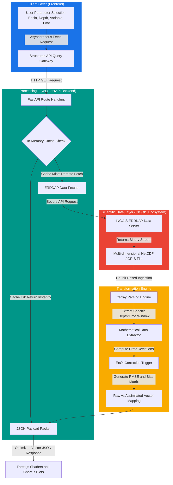

# 🖥️ Sagar-Drishti Backend Architecture & Data Pipeline
> **A Comprehensive Guide to the FastAPI, ERDDAP, NetCDF Translation, and EnOI Data Pipeline**

This document details the step-by-step data lifecycle, architectural workflow, and core engineering justifications driving the **Sagar-Drishti** data processing engine.

---

## 🗺️ End-to-End Core Data Lifecycle

---

## ⚙️ Step-by-Step Technical Execution & Justifications

### 📍 Step 1 — Frontend Request Generation
* **Mechanism:** When a researcher manipulates client-side parameters (e.g., swapping viewports from *Bay of Bengal* to *Arabian Sea*, altering depth layers, or switching variables to Chlorophyll), the interface aggregates these states into structured query segments.
* **API Endpoints:** 
  * `/api/floats?basin=bay_of_bengal`
  * `/api/model-field?variable=TEMP&depth=340`
* **Reasoning:** Binding input controls (dropdowns, depth-sliders) directly to declarative parameters ensures smooth frontend component routing and predictable state sharing.

### 📍 Step 2 — Gateway Ingestion via FastAPI
* **Mechanism:** The generated query routes hit a lightweight Python backend running **FastAPI**.
* **Reasoning:** FastAPI is chosen over bulky frameworks due to its near-native asynchronous architecture and automatic OpenAPI documentation generation. This guarantees high concurrency handling, moving fluidly from short-burst hackathon testing to scalable real-world data pipelines.

### 📍 Step 3 — INCOIS ERDDAP Server Connection & Translation
* **Mechanism:** The backend initiates secure handshakes with the **INCOIS ERDDAP data servers**, where heavy Argo telemetry outputs and predictive ocean models are stored.
* **The Technical Challenge:** These source files exist natively in complex multidimensional binary architectures called **NetCDF** or **GRIB**. Standard web browsers cannot read or parse binary array objects directly.
* **Reasoning:** The FastAPI service acts as an abstraction/translation layer, parsing data streams into standard text-based protocols.

### 📍 Step 4 — Non-Blocking Extraction via `xarray`
* **Mechanism:** The backend utilizes the **`xarray`** python engine to run optimized operations over the target binary stream.
* **Reasoning:** Raw netCDF databases scale into multiple gigabytes, making instant full downloads impossible under low networks. `xarray` enables remote slicing—pulling only the exact multi-dimensional box requested by the user, skipping bulk downloads completely and lowering latency down to milliseconds.

### 📍 Step 5 — JSON Transformation and Strategic Caching
* **Mechanism:** Extracted telemetry and grid matrices are packed cleanly into optimized nested JSON arrays. Concurrently, a localized **Caching Layer** captures the active query signature.
* **Reasoning:** If multiple remote nodes or judges query the exact same region/depth block simultaneously, the server drops redundant requests to INCOIS infrastructure, reading records out of memory blocks instead. This limits network congestion and speeds up client render triggers.

### 📍 Step 6 — Stream Dispatch & Graphic Injection
* **Mechanism:** The compressed JSON array is delivered to the browser layer. The system intercepts the payload, instantly routing multi-dimensional array packets directly into active **Three.js** canvas containers.
* **Reasoning:** The structural visual components (3D grids, shader arrays, floating hulls) remain fully painted on the screen; only the data-bound matrices swap from mock instances to physical observation values in real-time.

### 📍 Step 7 — EnOI Correction & Delta Cross-Referencing
* **Mechanism:** Upon establishing target coordinate vectors, the backend fires a synchronized sub-pipeline, simultaneously fetching the raw numerical forecasting outputs alongside physical buoy records to determine spatial deltas.
* **Reasoning:** These calculated deviations drive the core toggle switch comparing **View A (Raw Predictive Model)** against **View B (EnOI-Corrected Field)**, allowing users to visibly check localized data assimilation efficiency instantly.
