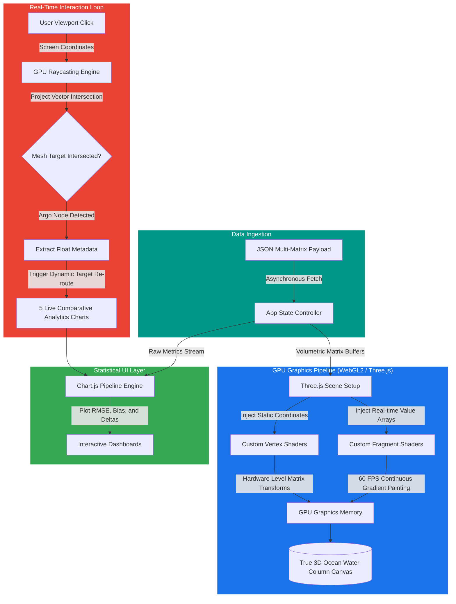

# 🎨 Sagar-Drishti Frontend Graphics & Rendering Engine
> **A Deep Dive into WebGL, Custom GPU Shaders, Raycasting Interactivity, and Dynamic Charting**

This document details the low-level graphics pipeline, rendering strategies, and engineering choices that allow **Sagar-Drishti** to deliver immersive, 60 FPS ocean datasets directly in the client browser with zero installation overhead.

---

## 🗺️ Browser Rendering Pipeline

---

## ⚙️ Low-Level Technical Mechanics & Justifications

### 📍 1. True 3D Volumetric Rendering (WebGL & Three.js)
* **The Core Mechanic:** Instead of rendering flat 2D maps or standard charts, the frontend utilizes **WebGL** via **Three.js** to build an interactive, volumetric representation of the ocean water column (similar to the technology stack driving Google Earth).
* **Reasoning:** Oceanography parameters dynamically morph based on depth variations. A true 3D spatial space allows researchers to manually twist, turn, zoom, and inspect deep ocean variables alongside the physical trajectories of Argo floats simultaneously in one workspace.

### 📍 2. Real-Time Hardware Gradients (Custom GLSL Shaders)
* **The Core Mechanic:** We bypassed standard CPU plotting loops and wrote custom **GLSL (OpenGL Shading Language)** Vertex and Fragment shaders that compile and execute directly on the user's GPU graphics processing units.
* **Reasoning:** Standard CPU rendering chokes and lags when plotting thousands of multi-dimensional matrix points. By uploading raw temperature and salinity arrays straight to the GPU, our fragment shader automatically paints smooth, continuous color vector fields at a locked **60 Frames Per Second (FPS)** refresh rate, even on standard consumer laptops or mobile screens.

### 📍 3. Low-Latency Interactivity (GPU Raycasting)
* **The Core Mechanic:** When a user clicks anywhere on the 3D scene canvas to inspect a floating target node, the engine utilizes a **Raycaster matrix transform**. It projects an imaginary 3D geometric ray vector from the exact 2D camera viewport click point into the active 3D world scene grid.
* **Reasoning:** Bypassing traditional flat search loops across large arrays, raycasting identifies instantly which specific **Argo Float asset vector mesh** was intersected by the pointer, pulling up its local profile, historical tracking trajectory, and provenance parameters on the fly.

### 📍 4. Multi-Variant Statistical Displays (Chart.js Engine)
* **The Core Mechanic:** Upon selecting an active float node, the user enters the model-versus-observation workspace. The system loads data metrics asynchronously into **Chart.js** pipelines to plot **5 live comparative analytics charts**.
* **Reasoning:** These dashboards graphically display model outputs against true physical buoy readings, showcasing raw deviations, delta changes, and calculated verification thresholds (RMSE and Bias) in a clean, interactive canvas layout.
